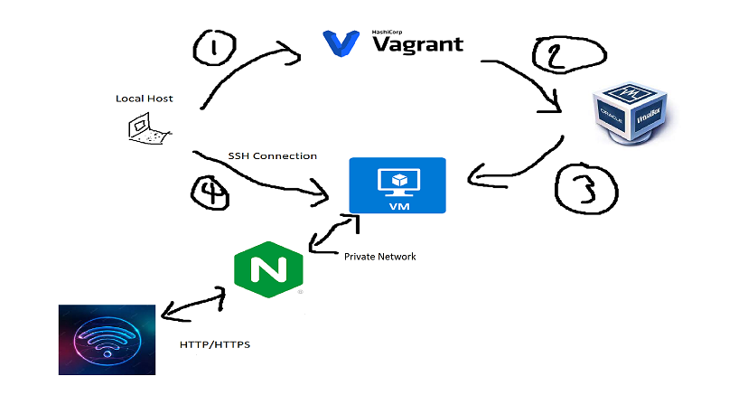

# Virtualisation


### What is Virtualisation and what are the benefits?
Virtualisation recreates the hardware of a different operating system through the use of software.

Virtualisation increases security, saves on investments on hardware and also the running costs of the hardware. It also makes it simpler to manage.
### What is Vagrant?
Open source software product for building and maintaining virtual machines

### What is VirtualBox?
It allows users to extend their existing computer to run multiple operating systems including Microsoft Windows, Mac OS X, Linux, and Oracle Solaris, at the same time. 
## Vagrant Setup
### Prerequisites 
1. Install Ruby
2. Install Vagrant
3. Install VirtualBox
4. (WINDOWS USERS) Control Panel --> Network and Internet --> Network and Sharing Center --> Change adapter settings --> VirtualBox Host-Only Network (Properties) --> Install --> Service --> Manufacturer: Oracle Corporation, Network Service: VirtualBox NDIS6 Bridged Networking Driver --> Click OK
5. Create a directory and then a file. Input the following into the file.
```
Vagrant.configure("2") do |config|

 config.vm.box = "ubuntu/xenial64" # Linux - ubuntu 16.04

# creating a virtual machine ubuntu 

end
```
6. `vagrant up` to start up the VM
7. Check the status using `vagrant status`
8. Use `vagrant ssh`

You are now inside the virtual machine.

You can use `exit` to leave the VM.

### Creating a VM from command line
1. run `vagrant up`


2. run `vagrant ssh`


3. Your command line should now display this (you are inside the virtual machine).


We will now be automating the update and upgrade of the OS.

1. Create a shell file.


2. Input the commands into the file


3. We can check if the file has any permissions.


4. Give execute permissions to the file.


5. Run the file.


## Useful Linux commands

### File Handling

https://kinsta.com/blog/linux-commands/

- How can we find out the name of OS `uname` or `uname -a` 
- How to create a file in linux, `touch filename` or `nano filename` 
- How to check existing file/folders `ls` or `ls -a`
- How to create a folder `mkdir foldername`
- How to navigate to the folder `cd foldername`
- How to come out of folder (1 step back) `cd ..`
- How to check our current location `pwd`
- `whoami` returns the username
- how to copy file `cp filename_with_absolute_path destination_with_absolute_path` 
- how to remove file/folder `rm -rf filename/foldername`
- how to cut paste the file/move the test file `mv filename_with_absolute path destination_with_absolute_path`
- rename with `mv prev_name new_name`
- how to present processes `top` exit with `ctrl c`. Can also use `ps aux`
- `|` (also known as pipe) allows the output from one command to be carried to the next. e.g `Command-1 | Command-2 | …| Command-N`
- can act as admin/root user with `sudo su` or `sudo i`
- how to check file permissions `ll`
- how to change file permission `chmod permission filename`
- to make executable `chmod +x filename`, `all`, `r`, `w`, `rw` also numbers `400` or `600` for all `700`
- update our ubuntu OS `sudo apt-get update`
- upgrade our ubuntu os `sudo apt-get upgrade` or `sudo apt-get upgrade -y` (-y automates prompted response)
- ./filename to run it if is exe
- contents of a file `cat filename`
  
  
### How to kill a process
  
`sudo kill -9 PID`

Or you can do it in the top function
  

  
You can also kill all processes of a given program with `killall -I process_name` (case insensitive, use -i for case sensitivity)
  
### World Wide Web commands

- Checks network status of a specific domain `ping domain` or `ping ip address`
- Retrieves the content `wget domain_name`

### NGINX
- Enter your vagrant file `config.vm.network "private_network", ip: "192.168.10.100"`


- Install nginx `sudo apt-get install nginx`
- How to check if it is running  `sudo systemctl status nginx` 
- restart or start `sudo systemctl restart nginx ` `sudo systemctl start nginx ` `sudo systemctl stop nginx `
- enable the process `sudo systemctl enable nginx`

## Deployment


NOTE: Nodejs operates on port 3000

- To install the package manager for ruby use `gem install bundler` and then `bundle` to install all dependencies
- Sync files to VM from LH in the Vagrant file using `config.vm.synced_folder ".", "/home/vagrant/app"`
- Restart VM after editing (remember to save files too) using `vagrant reload`


- rake spec to test the dependencies

How to install the correct version of nodejs 
```
Using Ubuntu
sudo apt-get purge nodejs npm

curl -sL https://deb.nodesource.com/setup_6.x | sudo -E bash -
sudo apt-get install -y nodejs
```
Use to update
`sudo apt-get update && sudo apt-get install yarn`

`sudo npm install pm2 -g` the -g means to install globally, npm is a package manager for js (similar to pip for python)

Inside app folder where app.js use: `npm install` followed by `npm start`
